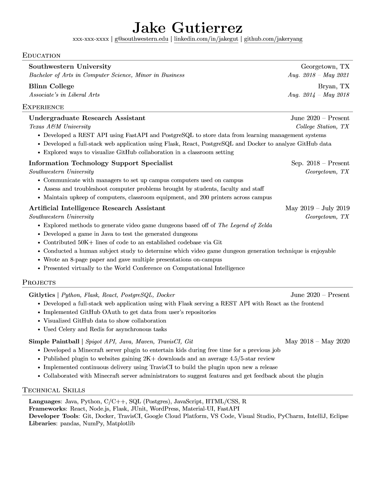

# resume

LaTeX source for my personal resume.

Based off of [sb2nov/resume](https://github.com/sb2nov/resume/)

Use it on overleaf: [Jake's Resume](https://www.overleaf.com/latex/templates/jakes-resume/syzfjbzwjncs) (Not updated)



## Layout

| File | What it is |
|---|---|
| `resume.tex` | The source. This is the only file you edit. |
| `resume.pdf` | The build output. Committed, because it's the thing that actually gets sent. |
| `resume.png` | Default render of the resume from the markdown. |

## Building on Overleaf (canonical)

The committed `resume.pdf` is built on Overleaf. Under **Menu → Settings**:

| Setting | Value |
|---|---|
| Compiler | **LuaLaTeX** |
| TeX Live version | **2024** |
| Compile mode | **Normal** |

Then **Recompile → Download PDF**, and save it over `resume.pdf` in this repo.

### Why LuaLaTeX specifically

The preamble pins the engine from both directions, so the other engines are not interchangeable:

- `fontspec` with `\setmainfont{Times New Roman}` needs a Unicode engine, which rules out **pdfLaTeX**.
- `\input{glyphtounicode}` and `\pdfgentounicode=1` are pdfTeX primitives, kept available under LuaTeX by `luatex85`. XeLaTeX does not provide them, so **XeLaTeX** (and Tectonic, which is XeTeX-based) fails with `glyphtounicode: Undefined control sequence`.

LuaLaTeX is the only engine that satisfies both. Note that `\pdfgentounicode=1` is what makes the PDF's text layer copy-paste correctly, which is what ATS parsers read — so it is worth keeping.

## Building locally (optional)

Overleaf is the source of truth; local builds are for quick iteration. A minimal
TeX Live install is **not** enough — the document needs `luaotfload` (pulled in by
`fontspec`) and the Times New Roman font:

```sh
sudo apt install texlive-luatex texlive-latex-extra   # provides luaotfload
sudo apt install ttf-mscorefonts-installer            # provides Times New Roman
```

Without the first, the build dies with `module 'luaotfload-main' not found`.
Without the second, `Package fontspec Error: The font "Times New Roman" cannot be found.`

Then:

```sh
lualatex -interaction=nonstopmode resume.tex
```

Two caveats:

- **Local output will not be byte-identical to Overleaf.** Debian ships TeX Live 2023 (LuaHBTeX 1.17.0); Overleaf is on TeX Live 2024 (LuaTeX 1.18.0). The rendered page is the same, the file bytes are not. Commit the Overleaf build, not the local one.
- If you would rather not install the Microsoft fonts, `TeX Gyre Termes` is metric-compatible with Times New Roman and ships with TeX Live. Swapping `\setmainfont` changes the embedded font, so use it for previewing only — don't commit a PDF built that way.

## Cleaning up

A local build leaves `resume.aux`, `resume.log`, and `resume.out` beside the source.
None of them belong in the repo: